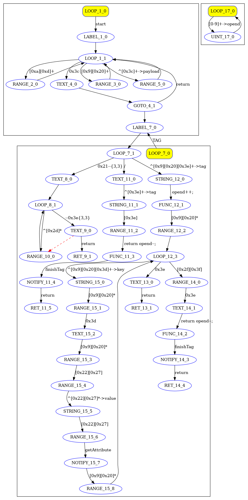

This is a demonstration of using the xml-parsing example.
The code (xml.h and xml.cc) was automatically generated using vProto at https://vsyn.ru
The application demonstrates the operation of both: full string and any byte-level data fragmentation.

The application uses input test data from 'input.txt' and outputs the result to the file 'output.txt'.

